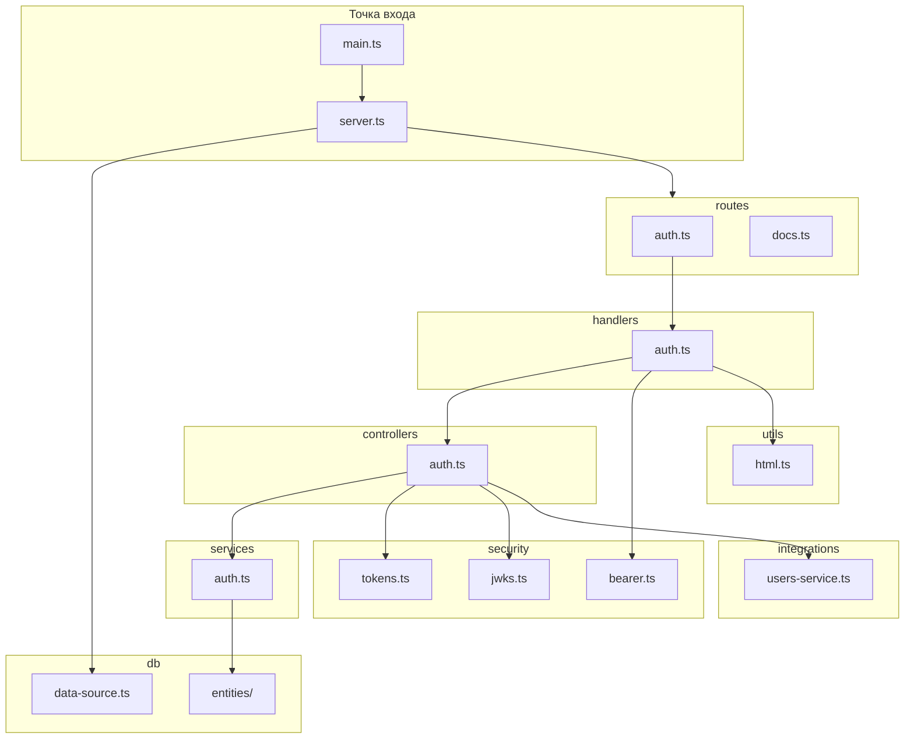
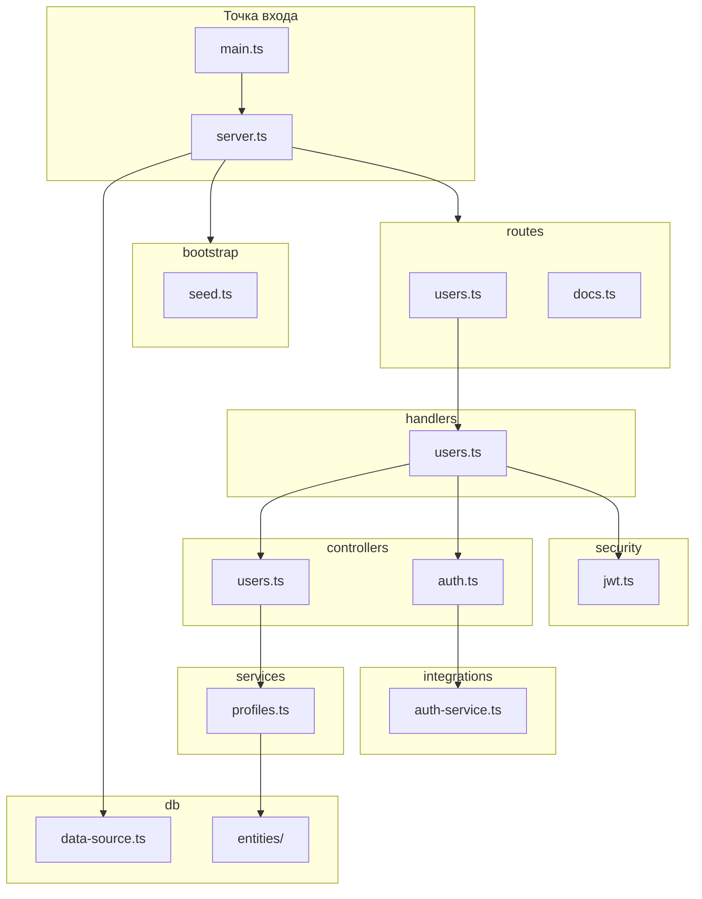
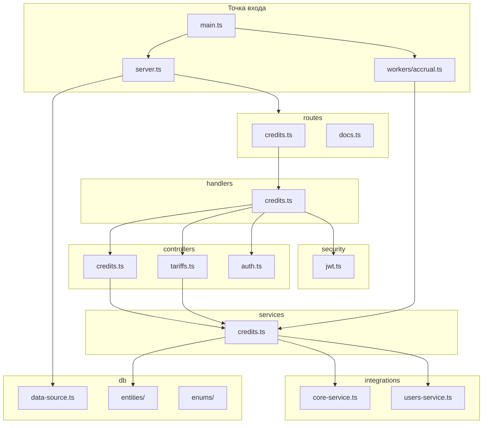
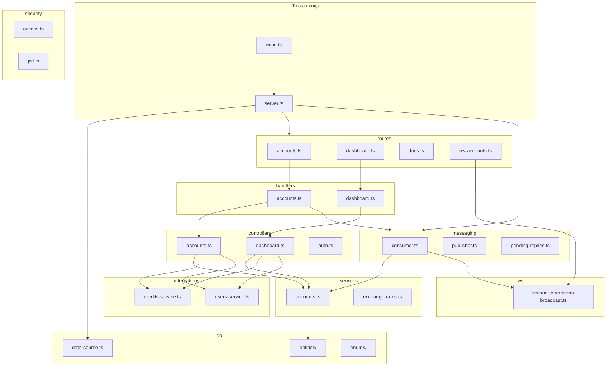
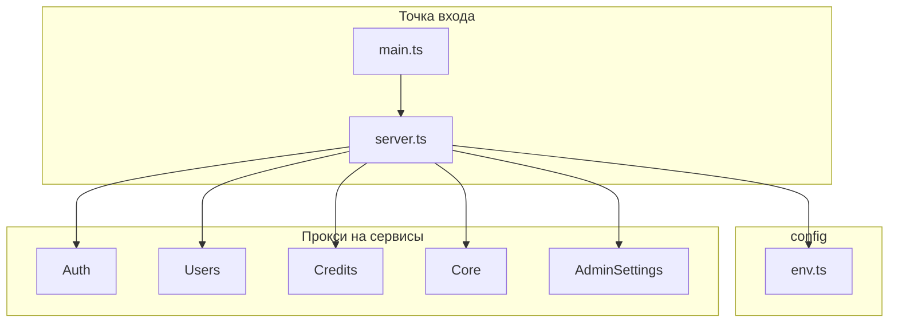
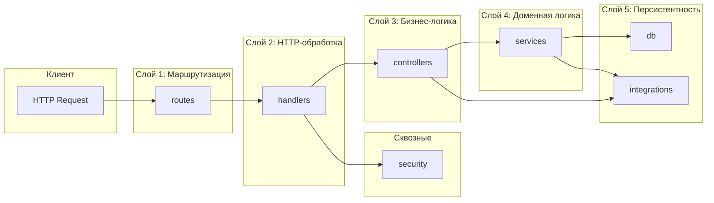

# Диаграммы пакетов сервисов

---

## 1. Auth Service

**Слои и поток данных:**
| Слой | Модули | Вызывает |
|------|--------|----------|
| Entry | main, server | db, routes |
| Routes | auth, docs | handlers |
| Handlers | auth | controllers, security |
| Controllers | auth | services, security, integrations |
| Services | auth | db/entities |
| DB | data-source, entities | – |
| Integrations | users-service | Users API |
| Security | bearer, tokens, jwks | – |

---

## 2. Users Service

**Слои и поток данных:**
| Слой | Модули | Вызывает |
|------|--------|----------|
| Entry | main, server | db, bootstrap, routes |
| Routes | users, docs | handlers |
| Handlers | users | controllers, security |
| Controllers | users, auth | services, integrations |
| Services | profiles | db/entities |
| DB | data-source, entities | – |
| Integrations | auth-service | Auth API |
| Bootstrap | seed | db |

---

## 3. Credits Service

**Слои и поток данных:**
| Слой | Модули | Вызывает |
|------|--------|----------|
| Entry | main, server, workers | db, routes |
| Routes | credits, docs | handlers |
| Handlers | credits | controllers, security |
| Controllers | credits, tariffs, auth | services |
| Services | credits | db/entities, integrations |
| DB | data-source, entities, enums | – |
| Integrations | core-service, users-service | Core API, Users API |
| Workers | accrual | services |

---

## 4. Core Service

**Слои и поток данных:**
| Слой | Модули | Вызывает |
|------|--------|----------|
| Entry | main, server | db, routes, messaging |
| Routes | accounts, dashboard, docs, ws | handlers |
| Handlers | accounts, dashboard | controllers, messaging |
| Controllers | accounts, dashboard, auth | services, integrations |
| Services | accounts, exchange-rates | db/entities |
| Messaging | consumer, publisher | services, ws |
| DB | data-source, entities, enums | – |
| Integrations | credits-service, users-service | Credits API, Users API |
| WS | broadcast | – |

---

## 5. Gateway Service

**Слои и поток данных:**
| Слой | Модули | Назначение |
|------|--------|------------|
| Entry | main, server | Запуск приложения |
| Config | env | Переменные окружения |
| Proxy | http-proxy | Проксирование на auth, users, credits, core, admin-settings |

Gateway не содержит бизнес-логики – только маршрутизацию запросов на целевые сервисы.

---

## Общая схема взаимодействия слоёв (типовой сервис)

**Правило зависимостей:** вызовы идут сверху вниз. Нижние слои не зависят от верхних.
